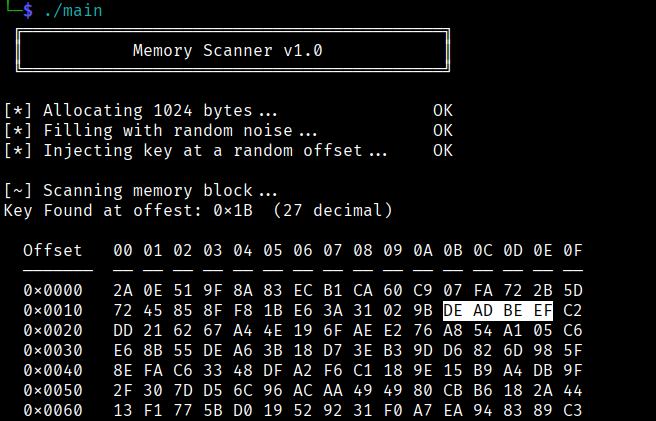

<div align="center">

# memory_scanner

A C learning project that simulates the core memory scanning technique used by EDR (Endpoint Detection & Response) solutions. The program allocates a heap buffer, fills it with random noise to mimic live process memory, then injects a known byte signature (`0xDE 0xAD 0xBE 0xEF`) at a random offset — the same way shellcode or a malware payload sits in a process's memory space. A byte-by-byte scan then walks the entire buffer searching for that signature, which is exactly what EDR agents like CrowdStrike or Defender do when they call `ReadProcessMemory()` against a monitored process. On a hit, the offset is reported and a hex dump is printed, mirroring how EDR consoles surface an IOC with surrounding memory context. Built to get hands-on with pointers, heap allocation, and `unsigned char` byte buffers in C.

## Build & Run
```bash
gcc main.c assets.c -o main
./main
```


